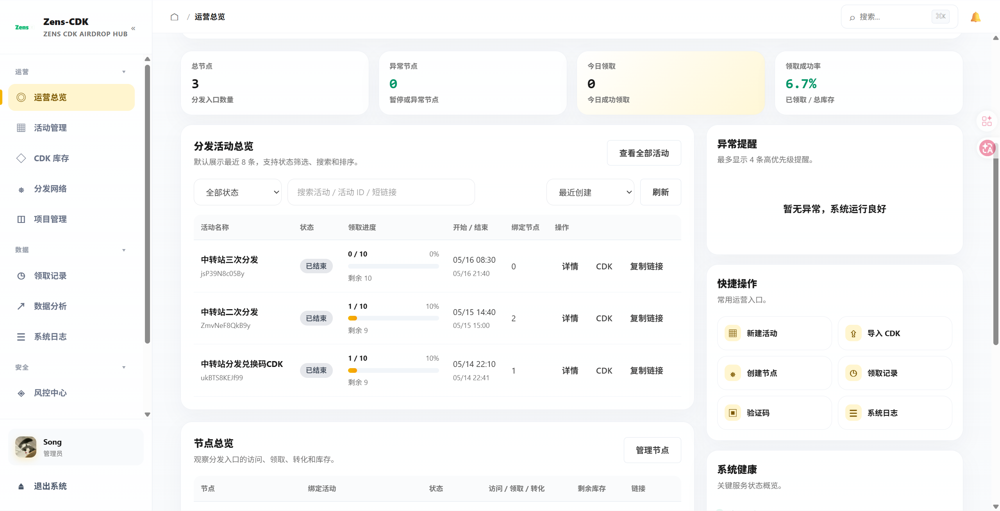
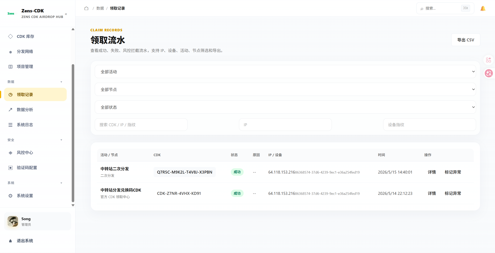
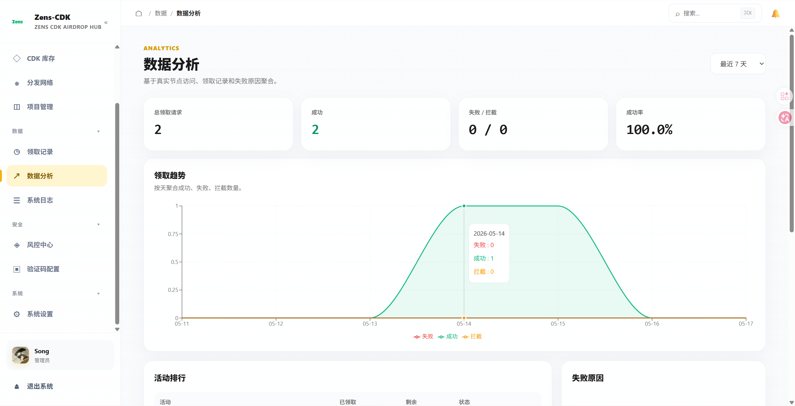

# 缪盒社区子站上线：CDK 空投台项目完整介绍

> 这是缪盒社区体系下的一个独立子站项目：**CDK 空投台**。  
> 它不是一个单纯的“兑换码页面”，而是围绕社区活动、权益发放、节点分发、领取风控、数据看板和后台运营搭建的一套完整 CDK 分发系统。  
> 对社区用户来说，它负责把活动奖励发得更清楚、更稳定、更公平；对运营和管理员来说，它提供项目创建、CDK 管理、领取记录、数据统计、风险控制和品牌配置等能力。

---

## 一、为什么要做这个 CDK 空投台？

在社区运营里，福利发放一直是一个高频但容易出问题的场景。

比如：

* 新用户注册后，需要发放新手礼包；
* 活动结束后，需要给参与用户发放兑换码；
* 社区节点、内测资格、会员权益、积分奖励需要按规则领取；
* 不同活动可能有不同的开始时间、结束时间、库存数量和领取限制；
* 管理员需要知道谁领了、什么时候领的、是否重复领取、有没有异常行为；
* 当活动流量突然变大时，系统还要保证库存扣减准确，不能出现超发、重复发或者领取记录丢失。

如果这些流程只靠人工发码、表格统计或者临时脚本处理，很容易变得混乱。尤其是社区用户规模上来以后，活动一多，人工维护成本会越来越高，也很难做到统一的体验和可追踪的数据。

所以我把它做成了一个社区子站：**CDK 空投台**。

它的定位很明确：

* 面向社区用户，提供一个干净、统一、可登录校验的领取入口；
* 面向社区运营，提供一个可以长期使用的活动发放后台；
* 面向整个社区系统，作为权益、兑换码、节点奖励、活动礼包的分发基础设施；
* 面向后续扩展，预留数据分析、风控、验证码、导出、备份、多存储等能力。

---

## 二、项目整体定位

> **CDK 空投台是缪盒社区的福利发放中心，也是社区活动权益的集中分发子站。**

它可以理解为社区主站之外的一个独立功能站点。主站负责用户、内容、互动和社区身份；CDK 空投台负责活动奖励的创建、库存管理、领取校验、记录追踪和结果展示。

用户从社区进入活动领取页后，不需要面对复杂的后台逻辑，只需要登录社区账号，然后按照活动规则领取自己的奖励。管理员则可以在后台创建项目、配置规则、导入 CDK、查看领取记录、观察数据趋势，并且在出现异常领取时进行风险处理。

这个项目不是只为某一次活动写的临时代码，而是按照“长期社区运营工具”的思路设计的。它既可以用于简单的兑换码发放，也可以承载更复杂的活动权益系统。

---

## 三、项目截图预览

下面是当前项目里整理的几张展示图，可以作为社区帖子里的视觉说明：







这些页面分别对应用户入口、领取记录和数据分析能力。整体风格偏简洁、现代，重点不是堆装饰，而是让用户能快速完成领取，让管理员能快速判断活动状态。

---

## 四、用户侧体验：从社区身份到一键领取

用户侧最核心的路径是：

* 从社区活动入口进入 CDK 空投台领取页；
* 使用社区账号完成登录或单点登录；
* 查看当前活动标题、说明、规则和领取状态；
* 在满足条件时点击领取；
* 成功后展示 CDK、兑换链接、权益说明或其他奖励内容；
* 系统记录领取行为，防止重复领取和异常领取。

这个过程尽量减少用户理解成本。用户不需要知道后台有多少项目、库存怎么扣、数据怎么写入，只需要明确三件事：

* 这个活动是什么；
* 我是否满足领取条件；
* 领取成功后我拿到了什么。

对于社区场景来说，这一点很重要。福利活动如果流程复杂，用户很容易放弃；如果领取过程不透明，用户又会觉得不可信。所以这个子站把领取页做成独立入口，把管理后台和用户领取体验分开，让用户只接触必要信息。

---

## 五、后台管理：让活动发放变成可运营的流程

CDK 空投台的后台不是简单的“导入几个码”，而是围绕活动运营做了一套完整管理流程。

管理员可以在后台完成：

* 创建 CDK 项目；
* 设置项目名称、标签、说明、开始时间和结束时间；
* 配置领取门槛，例如社区等级、社区分数、积分消耗等；
* 配置 CDK 类型，例如一次性激活码、通用兑换码、批量独立码；
* 配置奖励类型，例如文本内容、权益包、积分、会员天数、API Key、兑换链接等；
* 设置总库存、每日领取限制、单用户领取次数限制；
* 设置是否限制相同 IP；
* 生成或导入 CDK；
* 复制领取链接；
* 查看近期领取记录；
* 查看库存剩余和领取趋势；
* 对异常记录进行标记；
* 导出 CDK、领取记录和日志。

这套后台让活动从“临时处理”变成了“可创建、可配置、可观察、可复盘”的流程。

尤其是在社区活动频繁的时候，后台能明显降低维护成本。比如这次要发内测资格，下次要发积分兑换码，再下一次要发会员天数，都可以复用同一套项目模型，只需要调整规则和奖励内容。

---

## 六、项目、活动、节点的设计思路

这个系统不是把所有 CDK 全部堆在一个列表里，而是拆分成更清晰的运营对象：

* **项目**：对应一个发放主题，例如某次社区活动、某个权益包、某个内测资格；
* **活动批次**：对应某段时间内的运营活动，可以暂停、恢复、结束；
* **领取节点**：对应具体的领取入口或分发链接，方便不同渠道、不同页面、不同活动入口分别统计；
* **CDK 库存**：对应具体可发放的兑换码或奖励内容；
* **领取记录**：记录用户、时间、IP、设备指纹、结果和风险状态；
* **数据分析**：汇总访问、领取、转化、失败原因和排行情况。

这样的拆分是为了后续扩展。社区活动不是一成不变的，未来可能会有不同版块、不同用户组、不同活动渠道。如果所有东西都混在一个表里，后期会很难维护。而通过项目、活动和节点的分层，就能更方便地做统计、权限、筛选和追踪。

---

## 七、风控与公平性：尽量减少刷领和重复领取

社区福利发放最怕的不是发不出去，而是被少数人用脚本或者多账号刷完。

所以 CDK 空投台在领取流程里加入了多层限制和风控思路：

* 登录校验：领取前需要识别用户身份；
* 单用户限制：可以限制每个用户领取次数；
* IP 限制：可以限制同一 IP 的领取频率；
* 设备指纹：用于识别同一设备切换账号的情况；
* User-Agent 检测：识别常见脚本、爬虫、自动化工具特征；
* 项目尝试频率：限制同一用户在短时间内反复尝试；
* 黑名单与风险规则：后台可以维护风险对象和规则；
* hCaptcha：可以对需要更高防护的节点启用验证码；
* 风险记录：异常领取行为可以进入后台追踪。

当然，任何风控都不是绝对的，但它能让普通活动具备基本防刷能力。对于社区来说，重点是让大多数真实用户能正常领取，同时提高恶意刷领的成本。

---

## 八、数据看板：活动效果不再靠猜

CDK 空投台还提供了数据看板能力，用来观察活动运行情况。

后台可以看到：

* 总用户数；
* 总项目数；
* 总领取数；
* 最近领取数；
* 库存总量；
* 已领取数量；
* 剩余数量；
* 领取趋势；
* 用户增长趋势；
* 项目状态分布；
* 热门项目；
* 活跃领取者；
* 活跃创建者；
* 失败原因；
* 节点排行；
* 活动排行。

这些数据对社区运营很有用。

比如一个活动发出去以后，管理员可以很快知道：

* 活动有没有人领取；
* 库存消耗速度是否正常；
* 是否需要追加 CDK；
* 是否存在异常高频领取；
* 哪个渠道或节点转化更好；
* 用户失败主要是因为未登录、库存不足、条件不满足，还是验证码失败。

这样后续做活动复盘时，就不只是看主观反馈，而是有真实数据可以参考。

---

## 九、技术架构：Go + React 的前后端分离实现

这个项目采用前后端分离架构。

后端使用：

* Go；
* 原生 HTTP 服务；
* slog 结构化日志；
* JWT 鉴权；
* PostgreSQL；
* Redis；
* RabbitMQ；
* JSON 文件降级存储；
* Docker / Docker Compose 部署。

前端使用：

* React；
* Vite；
* React Router；
* Recharts；
* hCaptcha 组件；
* 自定义 CSS 设计系统。

项目结构大致如下：

```text
cdk-airdrop-station/
├── server/             # Go 后端服务
│   ├── internal/api    # API 接口处理
│   ├── internal/store  # 存储、风控、库存、导出等逻辑
│   ├── internal/model  # 数据模型
│   └── main.go         # 后端入口
├── web/                # React 前端
│   ├── src/pages       # 用户页与后台页面
│   ├── src/components  # 通用组件和业务组件
│   ├── src/layouts     # 后台布局
│   └── src/lib         # API、品牌、存储等工具
├── project-image/      # 项目展示截图
├── Dockerfile
├── docker-compose.yml
└── README.md
```

---

## 十、存储与部署：既能轻量跑，也能正式部署

CDK 空投台的存储设计比较灵活。

它支持：

* PostgreSQL 作为正式部署数据库；
* JSON 文件作为轻量级降级存储；
* Redis 用于高并发库存控制和风控计数；
* RabbitMQ 用于异步持久化任务；
* Docker Compose 一键编排部署。

正式部署时，可以通过 Docker Compose 启动 PostgreSQL，并将业务服务暴露到 `8088` 端口。Redis 和 RabbitMQ 是可选增强组件，如果只是小规模社区活动，可以先不用启用；如果活动流量较高，再接入缓存和队列能力。

这种设计对社区子站比较友好，因为它不会强制一开始就上很复杂的基础设施。可以先跑起来，再根据活动规模逐步增强。

---

## 十一、社区 SSO：和主社区账号体系打通

这个项目是社区子站，所以用户体系不能孤立。

CDK 空投台支持社区快捷单点登录，也就是用户可以通过社区主站身份进入领取系统。后端会解析社区 SSO Token，同步用户信息，并根据社区角色映射本系统里的用户身份。

当前逻辑里，本地登录和本地注册已经禁用，优先使用社区账号体系。这能保证：

* 用户身份和社区主站保持一致；
* 领取记录能关联真实社区用户；
* 管理员权限可以和社区角色联动；
* 子站不需要维护一套割裂的用户入口；
* 后续可以根据社区等级、积分、角色继续扩展领取规则。

这也是它作为“社区子站”而不是普通独立工具的重要区别。

---

## 十二、我比较满意的几个点

### 1. 领取页和后台分离

普通用户只看到领取需要的信息，不会被后台功能干扰。管理员则有完整的运营界面，能管理项目、活动、节点、CDK、记录、风控、验证码和系统配置。

### 2. 规则配置比较完整

活动可以设置时间、库存、领取次数、社区等级、社区分数、积分消耗、IP 限制、每日限制等规则。这样不同类型的社区活动都可以复用。

### 3. 支持多种奖励形态

它不只支持普通 CDK，也可以支持权益包、积分、会员天数、API Key、兑换链接和组合奖励。后续如果社区有更多权益系统，也可以继续扩展。

### 4. 有风控意识

领取系统如果没有防刷能力，很容易被脚本抢空。这个项目从一开始就把登录、IP、设备、频率、验证码、黑名单等因素纳入考虑。

### 5. 有数据复盘能力

活动不是发完就结束。数据看板和导出能力可以帮助后续复盘：哪些活动效果好，哪些节点转化高，哪些失败原因最多，哪些领取行为异常。

---

## 十三、后续还可以继续完善的方向

这个项目目前已经具备完整的基础形态，但后续还有很多可以继续增强的地方：

* 更细粒度的社区用户分组，例如按版块、身份组、活跃度发放；
* 更完整的积分系统联动，例如领取时实时扣减社区积分；
* 更强的审计日志搜索和筛选；
* 更清晰的活动复盘报告；
* 更多领取结果模板；
* 更完善的移动端适配；
* 多管理员协作和权限分级；
* 活动预约、订阅提醒和站内通知；
* 和社区帖子、任务、签到、成就系统联动；
* 更完善的高并发压测和监控告警。

对我来说，这个项目后续不只是一个 CDK 工具，而是可以继续发展成社区权益中心的一部分。

---

## 十四、总结

> **CDK 空投台的核心价值，是让社区福利发放从“手动、临时、不可追踪”变成“自动、可配置、可观察、可复盘”。**

它作为缪盒社区的子站，承担的是社区活动奖励分发的基础设施角色。

用户可以更方便地领取福利，管理员可以更稳定地组织活动，社区也可以通过数据了解活动效果。无论是新手礼包、内测资格、会员权益、积分奖励，还是普通兑换码发放，都可以放到这个系统里统一处理。

这次把它做出来，也算是把社区运营里一个非常常见但又很容易被忽略的环节补上了。后面我会继续围绕社区主站和子站联动，把它做得更稳定、更好用，也更适合长期运营。

---

## 项目关键词

* `社区子站`
* `CDK 空投`
* `兑换码发放`
* `活动运营`
* `权益中心`
* `领取风控`
* `数据看板`
* `Go`
* `React`
* `Docker`
* `PostgreSQL`
* `Redis`
* `RabbitMQ`

